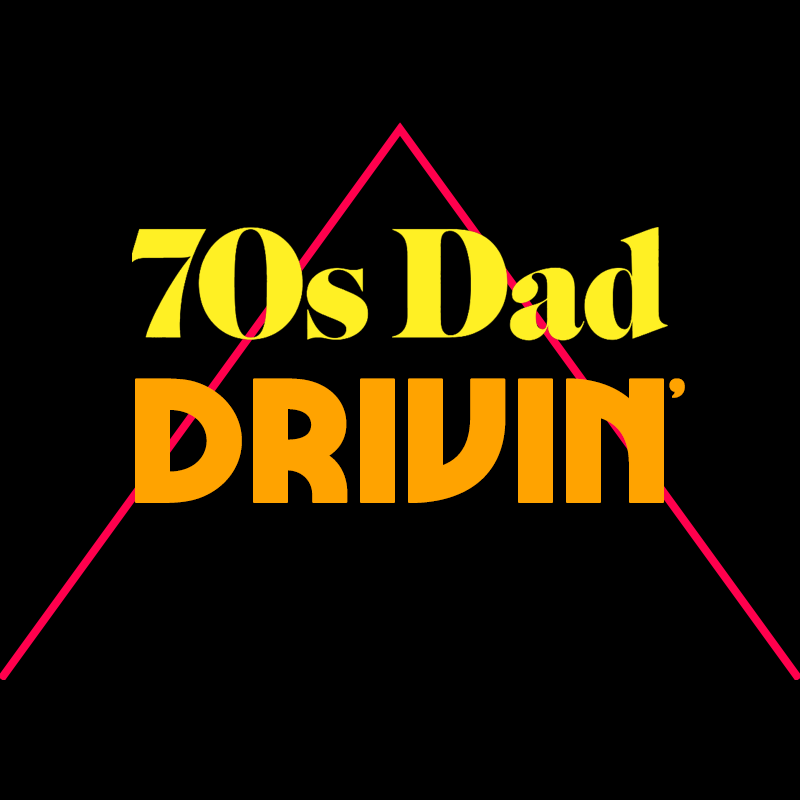

# 70s Dad Drivin'

```
Experience the thrill of being a Dad behind the wheel in the 70s!
Swerve wildly! Drink beers! Yell at your kids! Don't learn from your mistakes!

Controls
Z: Accelerate
X: Brake
Arrows steer and do ~other things~
```

This is my entry to the 2017 GitHub Game Jam. It is written for the [PICO-8](https://www.lexaloffle.com/pico-8.php) fantasy console.

## Building

If you want to modify this you can of course modify the p8 file directly, but if like me you prefer to work with a regular lua file I have included a python script that will copy the contents of throwback.lua into the `__lua__` section of throwback.p8. Just run `python build.py`.

[itchio](https://alligator.itch.io/70s-dad-drivin)

[lexaloffle bbs](https://www.lexaloffle.com/bbs/?tid=30349)


